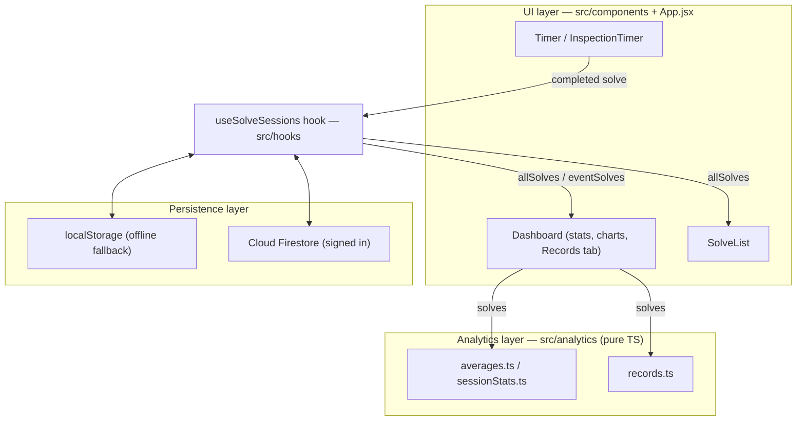

# CubeBox Architecture

This document describes how CubeBox is structured, for contributors.

## Overview

CubeBox is a React single-page application built with Vite, organized into three
layers:

1. **UI (React/JSX)** — components in `src/components` plus the `App.jsx` shell
   handle the timer, inspection, dashboard, and charts. Session and solve state
   (including offline-first Firestore sync) is extracted into the
   `useSolveSessions` hook (`src/hooks`), which components call into rather than
   owning that state themselves.
2. **Analytics (TypeScript)** — `src/analytics` is a pure, framework-free module
   that computes every solve statistic, including personal-record detection
   (`records.ts`). It has no React, Firebase, or browser dependencies.
3. **Persistence** — `src/firebase` initializes Firebase Authentication and Cloud
   Firestore. When Firebase is unconfigured, or the user is offline or signed out,
   the app falls back to `localStorage`.



Data flows one way through the analytics layer: components pass solve arrays
in and get back plain, presentation-ready results — nothing in `src/analytics`
ever reaches back into React state or storage.

## Analytics module

All statistics are derived from a list of solves. A solve has the shape:

```ts
{ millis: number; penalty?: "DNF" | "+2" | null }
```

Functions are pure and return a discriminated result rather than mixing numbers
and strings:

```ts
type AverageResult =
  | { status: "ok"; valueMs: number }
  | { status: "dnf" }
  | { status: "insufficient" };
```

Consumers decide presentation: the dashboard renders `dnf` and `insufficient` as
text, while charts map them to gaps (`null`). All computation is done in
milliseconds; UI consumers convert to seconds for display.

### Statistic semantics (WCA-style)

- **mean** — arithmetic mean of all valid solves. DNFs are excluded; +2 penalties
  are applied.
- **mo3** — arithmetic mean of three solves, no trimming. Any DNF makes the result
  a DNF.
- **aoN** (ao5, ao12, ao50, ao100) — drop the fastest and slowest `ceil(5%)`
  solves and average the remainder. DNFs sort as the slowest, so they are trimmed
  first; the result is a DNF only when a DNF survives the trim (i.e. there are more
  DNFs than the trim count).
- **best / worst** — fastest / slowest single valid solve, with +2 applied.

### Personal records (`records.ts`)

A record is fully derivable from the solve list itself — it doesn't need any
data that isn't already sitting on each solve (`id`, time, penalty,
timestamp). `computeRecordHistory` replays a chronologically-sorted solve
list once and reuses `rollingAverageOfN` (rather than a second averaging
implementation) to find every point where a new best was set, for the single
time and each aoN window.

This is deliberately **not** cached in a separate store. The Dashboard's
Records tab and the App-level PB celebration both call
`computeRecordHistory` fresh off `allSolves` (via `useMemo`, so it only
re-runs when solve data actually changes, not on every render). Deleting a
solve or editing its penalty is reflected correctly on the very next
recompute, because there's no separately-persisted snapshot that could drift
out of sync with the real solve list.

## Persistence and offline behavior

`localStorage` keys are prefixed `cubeboxtimer_*`. These are storage keys, not
branding — renaming them would orphan existing users' local data, so they are kept
stable.

Offline-first sync works through a write queue rather than an optimistic
network call: every `addSolve`/`updateSolve`/`deleteSolve` action updates
local React state immediately (so the UI never waits on a network round
trip) and appends an entry to a queue stored under the `cbt_write_queue`
localStorage key. When the user is signed in and online, `useSolveSessions`
flushes that queue against the Firestore REST API and removes each entry as
it succeeds; if a flush fails partway through (offline, a token error), the
remaining entries stay queued and retry automatically once the app detects
it's back online. This means solving works identically whether or not
Firebase is configured, signed in, or reachable — the only thing that
changes is whether writes eventually reach Firestore or stay local.

## Testing

The analytics module (including record detection) is unit-tested with Vitest
in `src/analytics/__tests__`. Because the module is pure, the tests are fast
and need no DOM or network. Components and hooks have their own
`__tests__` directories alongside them, using `@testing-library/react` with
a `// @vitest-environment jsdom` pragma per file.

## Observability

Logging and performance instrumentation are covered separately in
[`docs/architecture/observability.md`](observability.md).
