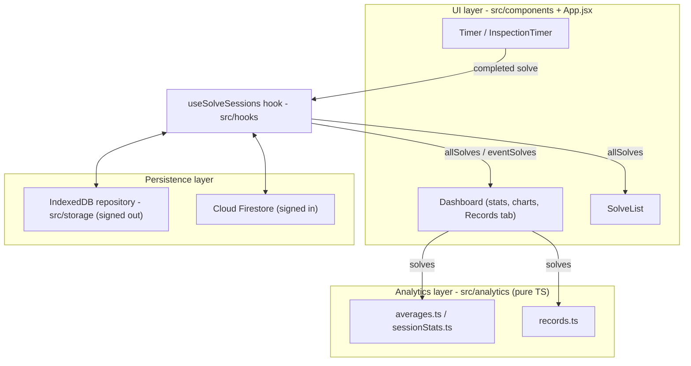

# CubeBox Architecture

This document describes how CubeBox is structured.

## Overview

CubeBox is a React single-page application built with Vite, organized into three
layers:

1. **UI (React/JSX)** - components in `src/components` plus the `App.jsx` shell
   handle the timer, inspection, dashboard, and charts. Session and solve state
   (including offline-first Firestore sync) is extracted into the
   `useSolveSessions` hook (`src/hooks`), which components call into rather than
   owning that state themselves.
2. **Analytics (TypeScript)** - `src/analytics` is a pure, framework-free module
   that computes every solve statistic, including personal-record detection
   (`records.ts`). It has no React, Firebase, or browser dependencies.
3. **Persistence** - `src/storage` owns durable local data behind a small
   typed repository interface backed by IndexedDB; `src/firebase` initializes
   Firebase Authentication and Cloud Firestore. When Firebase is unconfigured,
   or the user is offline or signed out, the app runs entirely on the local
   repository. Small synchronous values (UI preferences, the active session
   id, the offline write queues) stay in `localStorage`.



Data flows one way through the analytics layer: components pass solve arrays
in and get back plain, presentation-ready results - nothing in `src/analytics`
ever reaches back into React state or storage. The heavy computations run in
a dedicated Web Worker (see "Analytics worker" below); the module itself is
identical on both threads.

## Analytics module

All statistics are derived from a list of solves. A solve has the shape:

```ts
{ millis: number; penalty?: "DNF" | "+2" | null }
```

Functions are pure and return a discriminated result rather than mixing numbers
and strings:

```ts
type AverageResult =
  | { status: "ok"; valueMs: number }
  | { status: "dnf" }
  | { status: "insufficient" };
```

Consumers decide presentation: the dashboard renders `dnf` and `insufficient` as
text, while charts map them to gaps (`null`). All computation is done in
milliseconds; UI consumers convert to seconds for display.

### Statistic semantics (WCA-style)

- **mean** - arithmetic mean of all valid solves. DNFs are excluded; +2 penalties
  are applied.
- **mo3** - arithmetic mean of three solves, no trimming. Any DNF makes the result
  a DNF.
- **aoN** (ao5, ao12, ao50, ao100) - drop the fastest and slowest `ceil(5%)`
  solves and average the remainder. DNFs sort as the slowest, so they are trimmed
  first; the result is a DNF only when a DNF survives the trim (i.e. there are more
  DNFs than the trim count).
- **best / worst** - fastest / slowest single valid solve, with +2 applied.

### Personal records (`records.ts`)

A record is fully derivable from the solve list itself - it doesn't need any
data that isn't already sitting on each solve (`id`, time, penalty,
timestamp). `computeRecordHistory` replays a chronologically-sorted solve
list once and reuses `rollingAverageOfN` (rather than a second averaging
implementation) to find every point where a new best was set, for the single
time and each aoN window.

This is deliberately **not** cached in a separate store. The Dashboard's
Records tab and the App-level PB celebration both call
`computeRecordHistory` fresh off `allSolves` (via `useMemo`, so it only
re-runs when solve data actually changes, not on every render). Deleting a
solve or editing its penalty is reflected correctly on the very next
recompute, because there's no separately-persisted snapshot that could drift
out of sync with the real solve list.

### Competition performance prediction (`competitionPrediction.ts`)

`predictCompetitionResult` extrapolates from practice data to a likely
official result: for every past `CompetitionResult`, it compares the
practice average in the `computePracticeWindow` immediately before that
competition against the official average, and averages that gap
(`computeAdjustmentFactor`) into a single, fully transparent adjustment
factor - applied to the current practice window to produce a prediction.
Confidence (`computeConfidence`) is a fixed rule ladder over sample size and
gap variance, not a fitted score. Like `records.ts`, this reuses existing
analytics (`mean`, `rollingAverageOfN`, `computeSessionStats`) rather than
re-deriving them, and computes nothing that isn't already derivable from
solves and competition results.

This is surfaced in the Dashboard's Competition tab (`CompetitionTab.jsx`)
as the Prediction card and Why? section. `CompetitionResult`s can be
entered manually or imported from the WCA public API (see "WCA competition
import" below) - either way, this module only ever sees the same
persisted shape and treats both sources identically.

### Prediction backtesting (`backtesting.ts`)

`runBacktest` answers "how accurate have our predictions actually been?" by
replaying history: for every competition, it calls `predictCompetitionResult`
again with `now` pinned to that competition's own date and
`pastResultsForEvent` restricted to competitions strictly earlier than it -
the exact same function, just run as of an earlier point in time. A
competition is only "eligible" for scoring when that replayed call actually
produces a numeric prediction (there's at least one earlier competition,
and matching practice data existed at the time); this mirrors
`predictCompetitionResult`'s own "never fabricate a prediction" rule rather
than inventing a separate one. No prediction math is duplicated - this
module is purely an evaluation harness around the one canonical prediction
function.

Metrics (average/median absolute error, RMSE, bias) are plain arithmetic
over the resulting per-competition errors - see the formulas documented
directly in `backtesting.ts`. This is surfaced as the Competition tab's
Prediction Quality section, including a "Prediction Error Over Time" chart
built with the same Chart.js/lazy-load pattern as the Trend tab's
`StatsChart`.

### Prediction explainability (`predictionExplanation.ts`)

`explainPrediction` turns an already-computed `PredictionResult` and
`BacktestSummary` into a structured explanation - it recomputes nothing,
every field is either a direct passthrough (practice average, adjustment
factor, confidence level/interval, competitions used, DNF rate) or a plain
arithmetic reading of one (e.g. `historicalAverageErrorPct` is
`BacktestSummary.averageAbsoluteErrorPct`, reused rather than re-derived).

The one genuinely new computation is "Prediction Factors": five relative
contribution percentages (Practice performance, Historical adjustment,
Consistency, DNF history, Competition history) that sum to 100%. The
underlying prediction formula (`predicted = practiceAverage * (1 +
adjustmentFactor)`) only has two real terms, so this is **not** a
mathematically exact decomposition of that arithmetic - there's no way to
split a two-term product into five independent shares. It's a documented,
fixed-weight heuristic instead: each factor gets a plain score from fields
already on `PredictionResult` (adjustment factor magnitude, coefficient of
variation of recent practice, DNF rate, a saturating function of
competitions used, and a constant baseline for practice performance since
every prediction is unconditionally anchored to it), and the five scores
are normalized to sum to 100%. The exact formula for every score, and why
each was chosen, is documented inline in `predictionExplanation.ts` - there
is deliberately no ML, fitting, or hidden weighting here.

This is surfaced as the Competition tab's Prediction Breakdown (a detailed
summary-row card, one level more detailed than the Why? section above) and
Prediction Factors (a bar-chart breakdown reusing the same track/fill
markup as the Dashboard's Distribution tab - no new visual language).

### Model comparison (`predictionFeatures.ts`, `predictionModels.ts`, `modelComparison.ts`)

A second, additional way to predict a competition result, evaluated
side-by-side with the rule-based model above rather than replacing it.

**Feature engineering** (`predictionFeatures.ts`) turns solve + competition
history, as of one point in time, into a fixed `FeatureVector`: practice
mean/ao5/ao12/ao50, solve count, stddev, DNF/+2 rate, practice best, days
since the previous competition, the average gap between prior
competitions, prior competition count, and the rule-based model's error on
the most recent prior competition it could score (reusing `runBacktest`
rather than re-deriving it). `buildFeatureVector` only ever looks at data
strictly before its `referenceDateMs` argument - it filters and sorts
`priorResults` itself rather than trusting the caller, so a leakage bug
elsewhere can't silently corrupt a training row.

**Models** (`predictionModels.ts`), both operating on that same feature
vector:

- **Linear regression** - ridge regression (closed-form, standardized
  features) over practice mean, stddev, DNF rate, and prior competition
  count. Plain OLS was not an option: training rows are competitions, and
  most events have far fewer competitions than the four features, which
  OLS can't solve at all. A fixed ridge penalty (`RIDGE_LAMBDA = 1` on
  standardized, unit-variance columns) keeps the fit well-defined and
  numerically stable regardless of how few rows exist.
- **Nearest-neighbor** - weighted k-NN (`DEFAULT_KNN_NEIGHBORS = 3`) over
  the same standardized feature space, so no single raw feature (a
  practice mean in the thousands of ms vs. a 0-100 DNF rate) dominates the
  distance. An exact match is returned outright rather than diluted by a
  1/distance blend with farther neighbors.

Both degrade to `null` - never a fabricated number - exactly like the
rule-based model does with too little data.

**Evaluation** (`modelComparison.ts`) replays history with the same
walk-forward discipline as `backtesting.ts`: every prior competition
becomes its own training row, with features built from only what was known
as of *that* competition's date, one level deeper than
`runBacktest`'s existing "strictly earlier competitions only" rule.
`compareModels` runs the rule-based, linear regression, and
nearest-neighbor models over the same competitions and reports MAE, median
absolute error, RMSE, MAPE, and bias per model - each model's own evaluated
count reflects only the competitions it actually had enough data to score,
so a stricter model (e.g. linear regression needs 2+ usable training rows)
can legitimately evaluate fewer cases than a looser one. The best model is
the lowest MAE, tie-broken by evaluated count, then a fixed model-priority
order for full determinism. `explainBestModel` returns one of three fixed
sentences for which model won - a deterministic lookup, not generated
prose.

No external ML library: three models over at most a handful of
competitions per event don't need one, and a plain, from-scratch
implementation keeps every formula inspectable in the same way the
rule-based model already is.

Dataset construction (`mlDataset.ts`), the shared error metrics
(`mlEvaluation.ts`), and interval calibration (`calibration.ts`) are
documented in [`docs/architecture/model-evaluation.md`](model-evaluation.md).

This is surfaced as the Competition tab's Feature Snapshot (the live
feature vector, compact) and Model Comparison (the metrics table, with the
best model highlighted and its one-line explanation) - both sit alongside,
not instead of, the existing Prediction card and Prediction Quality
sections.

**Limitation:** with only a handful of competitions per event (the common
case), all three models are working with very little data, and their
relative ranking can shift as more competitions are added. The rule-based
model remains the default anywhere only one prediction is shown (the
Prediction card, Why?, Prediction Breakdown/Factors) - Model Comparison is
an additional, opt-in view of how the alternatives are doing, not a
replacement for it.

### Practice coach (`trainingSignals.ts`, `practiceCoach.ts`)

Answers "what should I practice next, and why?" with fixed rules over
observed data. `computeTrainingSignals` aggregates numbers only: practice
mean/stddev/DNF/+2 rate straight from `buildFeatureVector`, the
competition gap straight from `predictCompetitionResult.adjustmentFactorPct`
(never recomputed), backtest error from `runBacktest`, and days since the
last PB from `computeRecordHistory`. The only new computation is momentum -
a comparison between two adjacent 7-day practice windows. `practiceCoach.ts`
turns those signals into a readiness score (five equally-weighted
subscores), up to three focus areas from a fixed rule table (hardcoded
priority and drill per rule, array order as tie-break), and a list of
limitations when data is missing. Surfaced as the Dashboard's Coach tab.
Nothing here is persisted - it's recomputed from existing solves and
competition results on every render, the same way Model Comparison is.

Two small additions build on this without introducing any new persistence
or a bigger "engine": `trainingPlan.ts` reshapes `FocusArea[]` into Act
now / This week / Before competition buckets (the last only when a
competition date is supplied - there's no persisted "upcoming
competition" concept yet, so the Coach tab always passes `null` today).
`recommendationEvaluation.ts` replays each rule's own trigger condition
over a 60-day lookback, the same walk-forward shape as `backtesting.ts`,
to check whether the metric that fired a rule later crossed back past its
own threshold within a 14-day horizon. This is a retrospective rule check,
not a causal claim - output is "resolved" / "still active" / "not enough
later data," never "this recommendation worked."

### Analytics context (`platform/context.ts`, `platform/registry.ts`)

`createAnalyticsContext` is the single derived-data boundary between the
UI and the modules above: one immutable context per (event, solves,
competitions, now), with every output - records, prediction, backtest,
features, explanation, model comparison, signals, coach, plan, review -
computed lazily on first read and memoized for the context's lifetime.
CompetitionTab and CoachTab previously each assembled the same
filter → collapse-rounds → predict → backtest wiring by hand; both now
read from one context, so consumers can't drift apart or recompute shared
inputs. `registry.ts` lists each capability as a pipeline with an explicit
`dependencies` array mirroring the real module-level call structure, with
tests pinning that the graph is complete and acyclic. Outputs remain
deterministic and are never persisted.

### WCA competition import (`wcaImport.ts`, `wcaApi.js`, `useWcaImport.js`)

Lets a user pull their own past results from the WCA's public API instead
of typing every competition in by hand. Read-only, unauthenticated, no WCA
OAuth - `GET /api/v0/persons/{wcaId}/results` (every result the person has
ever recorded) and `GET /api/v0/competitions/{id}` (name + date, since
`/results` doesn't include either). Both were verified against the live
API before writing any code:

- **CORS is open** (`access-control-allow-origin: *` on every endpoint
  used) - a direct browser `fetch()` works with no proxy or backend. This
  was verified with `curl` and an explicit `Origin` header, since `curl`
  itself isn't subject to CORS (a browser-enforced restriction, not a
  server one) - a bare `curl` response can look CORS-less even when the
  server would happily answer a real cross-origin browser request. This is
  unauthenticated best-effort public access, not a documented SLA, which is
  why every call is wrapped with a timeout and a clear error message
  (`src/hooks/wcaApi.js`) rather than assumed to always succeed.
- There's no bulk competition-lookup endpoint, so competition metadata is
  fetched once per unique `competition_id` the person has relevant results
  for. This is capped at `WCA_METADATA_FETCH_CONCURRENCY` (4) requests in
  flight at once (`mapWithConcurrency`) rather than a single `Promise.all`,
  and a 429 is retried with backoff (honoring `Retry-After` when present)
  before that competition's results are given up on. Both were added after
  importing a real WCA ID with 100+ competitions reproduced live 429s from
  an unbounded `Promise.all` - concurrency limiting plus retry roughly
  doubled the import's success rate for that profile, but for a competitor
  with an unusually long history the WCA API can still out-throttle the
  retry budget for a handful of competitions; those results are skipped
  (`missing-competition-metadata`, counted and shown to the user) rather
  than silently dropped or blocking the rest of the import. This is a
  known limitation of relying on unauthenticated best-effort public access
  rather than a documented, rate-limit-free API.
- WCA times are centiseconds, with `-1` = DNF, `-2` = DNS, `0` = an unused
  attempt slot. A result whose *official average* is missing or DNF/DNS is
  skipped entirely rather than imported with a fabricated time -
  `CompetitionResult` has no separate DNF concept, and inventing one would
  mean teaching the rest of the Competition tab's UI to render it. `-1`/`-2`
  (`dnf-or-dns-average`) and `0`/other (`no-average`) are tracked as
  distinct `SkipReason`s, not merged, because they mean different things to
  a user reviewing why a result didn't import: one says "you DNF'd/DNS'd
  that round," the other says "that round never had an average to import in
  the first place" (e.g. a Bo1/Bo3 format that only records a best).
- A `(competition, event)` pair can have multiple rounds. The one WCA
  itself treats as "the" result is reliably the highest `round_id` in that
  group (verified against real multi-round data: first rounds always have
  a lower `round_id` than that competition's final round for the same
  event) - no need to hardcode WCA's round-type taxonomy. This is stated
  explicitly in the UI itself (the "Import from WCA" card), not just here,
  so a user isn't left guessing why an earlier round's result isn't the one
  that came in.
- Only WCA's four NxNxN speedsolving events CubeBox already supports
  (`222`/`333`/`444`/`555`) are mapped; every other WCA event (blindfolded,
  one-handed, FMC, ...) has no CubeBox equivalent and its results are
  skipped, reported to the user as a count rather than silently dropped.

All of this - ID validation, event mapping, time conversion, round
selection, and the duplicate/conflict policy below - lives in
`analytics/wcaImport.ts` as pure functions (same "no React, Firebase, or
browser dependencies" bar as the rest of `src/analytics`, even though the
subject matter is import rather than solve statistics). The actual
`fetch()` calls live in `src/hooks/wcaApi.js` instead, mirroring how the
impure Firestore REST helpers live in `firestoreRest.js` rather than in
analytics. `useWcaImport.js` orchestrates fetch → convert → dedupe →
persist and owns the import's loading/summary/error state; it calls the
exact same `addCompetitionResult`/`updateCompetitionResult` manual entry
uses, so imported results go through the same offline-first persistence
path as everything else in this document - never a second storage system.
Imported records carry `source: "wca-import"` and `wcaCompetitionId` (the
stable identifier future imports match against).

**Duplicate and conflict policy** (`checkForDuplicateOrConflict`,
`decideImportAction`) - deterministic, no fuzzy matching beyond a simple
normalized-word-overlap name check:

1. Same `wcaCompetitionId` + event as a previous import: identical values
   are skipped as `skip-already-imported`; different values (a late WCA
   results correction) deterministically update that same record - safe
   specifically because it's the same `wcaCompetitionId`, not a different
   competition being folded into an existing one.
2. Otherwise, compared against every existing record (manual or imported)
   for the same event and calendar day: identical times mean it's already
   present, tracked as `skip-duplicate`; a similar competition name with
   *different* times is a conflict, surfaced to the user rather than
   silently overwritten. Event+date matching an unrelated competition name
   is treated as two genuinely different results that happen to share a
   date. `skip-already-imported` and `skip-duplicate` are deliberately
   distinct `ImportDecision` variants, not one merged "duplicate" bucket -
   "you already imported this exact result" and "this matches something
   else you already had" are different findings, and the import summary
   explains both rather than a single opaque "skipped N."
3. The same primitive runs in the other direction: the manual "Add
   competition" form (`CompetitionTab.jsx`) checks a new entry against
   every existing record, including past imports. An exact duplicate is
   blocked outright; a conflict shows a warning and requires the user to
   resubmit unchanged to confirm - any field edit clears the pending
   warning, so a stale confirmation can never submit different data than
   what was actually reviewed. Editing an already-imported record through
   this same form no longer resets its `source` to `"manual"`, specifically
   so re-importing the same WCA result later still recognizes and updates
   it instead of creating a duplicate.

A manual record's own values are never rewritten by an import without the
user explicitly resubmitting through the conflict-confirmation flow above.

**Empty states and event scope.** Every section of the Competition tab
(prediction, historical calibration, results list, Prediction Quality) is
scoped to the currently selected cube event (`competitions.filter(c =>
c.event === cubeDimension)`) - the same selector that drives the timer and
scrambles. A note at the top of the tab states which event is in view and,
only when it would otherwise be non-obvious (`competitions.length >
competitionsForEvent.length`), that other events have results too - so a
user who just imported results across several events doesn't mistake "not
shown for 2x2x2 right now" for "wasn't imported." The prediction and
historical-calibration empty states go further than a bare "not enough
data": both build the actual sentence from the real counts (e.g. "CubeBox
found 5 3x3x3 competitions, but 0 have practice solves recorded in the
`DEFAULT_PRACTICE_WINDOW_DAYS` days before the competition date"), repeat
those counts as a small breakdown, and the prediction card adds a concrete
next step ("Add past practice solves near those competition dates, or
record future practice before your next competition") - see "Backfilling
practice solves" below for the UI that instruction points at.

### Backfilling practice solves (`SolveList.jsx`, `useSolveSessions.js`)

Importing WCA history is only useful to the prediction model if there's
practice data near each competition's date - for anyone who started using
CubeBox after those competitions happened, that data doesn't exist yet.
Two additions close that gap, both living in `SolveList.jsx` (the same file
that already handled solve deletion) rather than a new component, since
they're really the same "manage past solves" concern:

- **Delete is now always reachable, not just on hover/focus.** The
  hover/keyboard-revealed action bar (+2, DNF, delete) still exists for
  quick access, but every row also renders a persistent, smaller delete
  button (`Delete solve N`, a distinct accessible name from the action
  bar's plain `Delete solve`) whenever that fuller bar isn't showing. Touch
  devices have no hover state at all, so without this a delete control
  would have been practically unreachable there - keyboard deletion
  (arrow-key row focus + Delete/Backspace) and the "Undo last solve" button
  are both unchanged.
- **"+ Add past solve"** (in the list header and the empty state) opens a
  form - event, date, penalty (none/+2/DNF), time in seconds - and calls
  the exact same `addSolve` the live timer uses, through the exact same
  offline-first write-queue path (`useSolveSessions.js`) - no second
  storage mechanism. A DNF always stores `millis: 0` (matching how the live
  timer records one) and disables the time field, since a DNF's raw time
  isn't meaningful; a +2 stores the raw time as-is, with the 2000ms penalty
  applied later by `effectiveMillis()` exactly like a live +2 solve, never
  added at write time. The date input sets `localCreatedAt` directly (the
  same field `computePracticeWindow` filters on), so a backfilled solve
  participates in prediction/calibration exactly like one the timer
  recorded on that date.

  `addSolve` gained an optional second argument, an explicit event
  override, specifically for this form: the live timer's `addSolve(solve)`
  still implicitly targets whatever cube size is currently selected in the
  header, but a backfilled solve needs to target whichever event the user
  picks in the form - which may not be the header's current selection (a
  4x4x4 competition backfill shouldn't require switching the header away
  from 3x3x3 first). `deleteSolve`/`updateSolve` didn't need the same
  treatment - they only ever operate on rows already visible in
  `SolveList`, which is always the active event's solves.

## Analytics worker

Measured reason: at the current 8K-solve workload, record history took
~101 ms of main-thread time on every timer stop and the Coach tab's
recommendation evaluation took ~7.6 s; at the realistic 25K target those
grow to ~242 ms and ~19.8 s (linear scaling, measured with the committed
deterministic dataset). Structured-clone transfer costs are ~13 ms for a
full 25K-solve dataset and under 1 ms for results, so moving execution off
the main thread removes the blocking without meaningful boundary overhead.
This phase changes where analytics run, not how: the worker performs full
recomputation per request with the unchanged pure functions. There is no
incremental computation.

Ownership: the main thread owns React state, StorageRepository/IndexedDB,
migration, Firestore and the write queues, authentication, imports, the
dataset version counter, and the `now` passed to analytics. The worker
(`src/worker/analyticsWorker.ts`, logic in `analyticsWorkerCore.ts`) owns
an in-memory copy of the analytics inputs and executes requested nodes
through a fresh AnalyticsContext per request. It never touches storage,
Firebase, the DOM, the logger, or a clock (enforced by a source-scan test).

Protocol (`src/worker/protocol.ts`, version 1): `initialize` replaces the
worker's dataset wholesale after every durable change - full state
replacement was chosen over operation messages because operation-reducer
equivalence with the hooks is not yet proven by tests, and a full clone is
cheap relative to the work removed. `compute` carries a monotonically
increasing requestId, the datasetVersion it expects, the event, an explicit
`now`, and the node names to compute; the worker answers with `result` or
`error` (name + message only), both tagged with the datasetVersion they
were computed from. Messages are ordered per worker, so computes sent after
an initialize are always answered from the new dataset without an
acknowledgement round trip.

Stale results: the consuming hook (`useWorkerAnalytics`) applies a result
only when it is the newest request that hook issued and its datasetVersion
still equals the client's current version; an event switch clears results
immediately so another event's numbers are never shown. In-flight requests
are never cancelled, only ignored; bursts of dataset changes coalesce into
a single follow-up request.

Failure: on the first worker error the client logs it, terminates and
recreates the worker once, and re-initializes it from the latest
main-thread state. On repeated failure, or where Worker construction is
unavailable, it runs the identical core in-process (still behind
structured-clone message boundaries), which preserves behavior exactly at
the cost of main-thread time. There is no retry loop.

Kept on the main thread deliberately: active-session stats (a small slice
the worker state does not hold), the solve-list PB badge (a linear min),
chart data mapping, all display formatting, and peer comparison (network
bound, infrequent).

## Persistence and offline behavior

`localStorage` keys are prefixed `cubeboxtimer_*`. These are storage keys, not
branding - renaming them would orphan existing users' local data, so they are kept
stable.

### Storage boundary (src/storage)

Durable signed-out data - sessions with their solves, and competition
results - lives in IndexedDB behind `StorageRepository`
(`src/storage/repository.ts`): four methods (`loadSessions`,
`saveSessions`, `loadCompetitions`, `saveCompetitions`) shaped by how the
app actually uses persistence - hydrate everything once at startup, then
write the full snapshot after each change. Saves are replace-all inside one
IndexedDB transaction, which preserves the exact semantics the old
localStorage blobs had (deletes need no separate call; a failed write
leaves the previous snapshot intact). Two implementations exist: the
IndexedDB one (`indexedDb.ts`, database `cubeboxtimer` version 1, object
stores `sessions` and `competitions` with insertion-ordered keys and no
secondary indexes - every real read is a full hydration) and an in-memory
one (`repository.ts`) for tests and future differential harnesses. Shape
coercion for persisted records lives in `src/storage/normalize.ts`, shared
by the hooks, the migration, and any future consumer.

The hooks hydrate asynchronously and gate their persist effects until
hydration lands, so the initial empty React state can never overwrite the
stored snapshot. Both hooks expose this as a `hydrated` flag - the
signed-out analog of `firestoreLoading`.

### Migration from localStorage

The first signed-out hydration migrates the legacy `cubeboxtimer_sessions`
and `cubeboxtimer_competitions` blobs into IndexedDB
(`src/storage/migration.ts`). A three-state marker
(`cbt_idb_migration`: absent / `in-progress` / `complete`) makes the copy
safe against a page death at any point: the marker is set to `in-progress`
before the first write, and to `complete` only after reading the data back
and verifying it matches - until then the legacy keys remain the source of
truth and every retry redoes the whole copy (replace-all writes make that
idempotent). After `complete`, IndexedDB owns the data and legacy is never
consulted again, since re-copying would resurrect records the user deleted.
The legacy keys themselves are never removed or rewritten; they stay behind
as a frozen pre-migration snapshot. Malformed individual records are
dropped with a log line rather than aborting the migration around the valid
ones; an unparseable whole blob behaves like it always did (start fresh,
keep the blob).

### Operation vocabulary (src/storage/operations.ts)

Every durable mutation the app can perform has exactly one typed,
serializable operation shape (`AddSolve`, `UpdateSolve`, `DeleteSolve`,
`AddSession`, `RemoveSession`, `AddCompetitionResult`,
`UpdateCompetitionResult`, `DeleteCompetitionResult`), validated by
`validateOperation`. Nothing consumes these yet beyond their tests; they
exist so the planned operation log, analytics worker messages, replay, and
randomized differential tests share one mutation format instead of growing
incompatible ones. Operations carry no wall-clock reads - timestamps appear
only where the caller supplied them - so replaying an operation later
produces the identical record.

### Firestore conflict semantics

Concurrent writes resolve as last-write-wins at Firestore document
granularity, ordered by arrival at the server: the REST flush PATCHes whole
documents for creates and field-masked patches for updates, with no
client-clock or version comparison anywhere. The `ts` field on write-queue
entries only feeds `createdAt`/`localCreatedAt` defaults; it is never
compared. On the read side, each `onSnapshot` delivery replaces local state
wholesale, with still-pending queue entries overlaid on top. Nothing here
is conflict-free multi-device merging and the code does not claim to be.

Offline-first sync works through a write queue rather than an optimistic
network call: every `addSolve`/`updateSolve`/`deleteSolve` action updates
local React state immediately (so the UI never waits on a network round
trip) and appends an entry to a queue stored under the `cbt_write_queue`
localStorage key. When the user is signed in and online, `useSolveSessions`
flushes that queue against the Firestore REST API and removes each entry as
it succeeds; if a flush fails partway through (offline, a token error), the
remaining entries stay queued and retry automatically once the app detects
it's back online. This means solving works identically whether or not
Firebase is configured, signed in, or reachable - the only thing that
changes is whether writes eventually reach Firestore or stay local.

`CompetitionResult` (used by the prediction module above) is persisted the
same way, via `useCompetitionResults` (`src/hooks`): its own localStorage
key (`cubeboxtimer_competitions`), its own write queue
(`cbt_competition_write_queue`), and the same Firestore-REST flush loop.
The Firestore REST helpers (`toFirestoreValue`, `firestoreRestRequest`,
etc.) are shared between both hooks via `src/hooks/firestoreRest.js` rather
than duplicated, since they have no solve- or competition-specific
knowledge. Unlike solves, competitions aren't nested under a session - each
is a flat document under `users/{uid}/competitions/{id}` - so there's no
per-session solve-subcollection listener or embedded-solve migration to
mirror; the equivalent "migration readiness" seam is
`normalizeCompetitionDoc`, the same defensive-shape-coercion role
`normalizeSolveDoc` plays for solves.

## Testing

The analytics module (including record detection) is unit-tested with Vitest
in `src/analytics/__tests__`. Because the module is pure, the tests are fast
and need no DOM or network. Components and hooks have their own
`__tests__` directories alongside them, using `@testing-library/react` with
a `// @vitest-environment jsdom` pragma per file.

## Observability

Logging and performance instrumentation are covered separately in
[`docs/architecture/observability.md`](observability.md).
