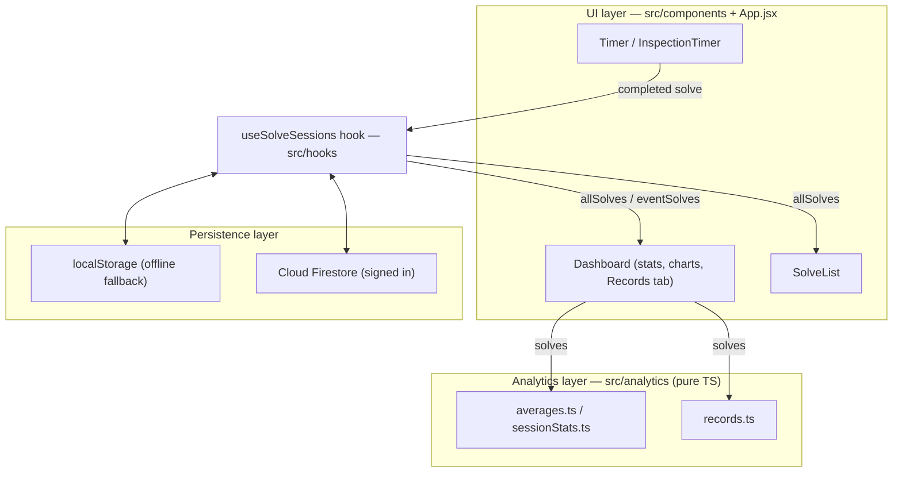

# CubeBox Architecture

This document describes how CubeBox is structured, for contributors.

## Overview

CubeBox is a React single-page application built with Vite, organized into three
layers:

1. **UI (React/JSX)** — components in `src/components` plus the `App.jsx` shell
   handle the timer, inspection, dashboard, and charts. Session and solve state
   (including offline-first Firestore sync) is extracted into the
   `useSolveSessions` hook (`src/hooks`), which components call into rather than
   owning that state themselves.
2. **Analytics (TypeScript)** — `src/analytics` is a pure, framework-free module
   that computes every solve statistic, including personal-record detection
   (`records.ts`). It has no React, Firebase, or browser dependencies.
3. **Persistence** — `src/firebase` initializes Firebase Authentication and Cloud
   Firestore. When Firebase is unconfigured, or the user is offline or signed out,
   the app falls back to `localStorage`.



Data flows one way through the analytics layer: components pass solve arrays
in and get back plain, presentation-ready results — nothing in `src/analytics`
ever reaches back into React state or storage.

## Analytics module

All statistics are derived from a list of solves. A solve has the shape:

```ts
{ millis: number; penalty?: "DNF" | "+2" | null }
```

Functions are pure and return a discriminated result rather than mixing numbers
and strings:

```ts
type AverageResult =
  | { status: "ok"; valueMs: number }
  | { status: "dnf" }
  | { status: "insufficient" };
```

Consumers decide presentation: the dashboard renders `dnf` and `insufficient` as
text, while charts map them to gaps (`null`). All computation is done in
milliseconds; UI consumers convert to seconds for display.

### Statistic semantics (WCA-style)

- **mean** — arithmetic mean of all valid solves. DNFs are excluded; +2 penalties
  are applied.
- **mo3** — arithmetic mean of three solves, no trimming. Any DNF makes the result
  a DNF.
- **aoN** (ao5, ao12, ao50, ao100) — drop the fastest and slowest `ceil(5%)`
  solves and average the remainder. DNFs sort as the slowest, so they are trimmed
  first; the result is a DNF only when a DNF survives the trim (i.e. there are more
  DNFs than the trim count).
- **best / worst** — fastest / slowest single valid solve, with +2 applied.

### Personal records (`records.ts`)

A record is fully derivable from the solve list itself — it doesn't need any
data that isn't already sitting on each solve (`id`, time, penalty,
timestamp). `computeRecordHistory` replays a chronologically-sorted solve
list once and reuses `rollingAverageOfN` (rather than a second averaging
implementation) to find every point where a new best was set, for the single
time and each aoN window.

This is deliberately **not** cached in a separate store. The Dashboard's
Records tab and the App-level PB celebration both call
`computeRecordHistory` fresh off `allSolves` (via `useMemo`, so it only
re-runs when solve data actually changes, not on every render). Deleting a
solve or editing its penalty is reflected correctly on the very next
recompute, because there's no separately-persisted snapshot that could drift
out of sync with the real solve list.

### Competition performance prediction (`competitionPrediction.ts`)

`predictCompetitionResult` extrapolates from practice data to a likely
official result: for every past `CompetitionResult`, it compares the
practice average in the `computePracticeWindow` immediately before that
competition against the official average, and averages that gap
(`computeAdjustmentFactor`) into a single, fully transparent adjustment
factor — applied to the current practice window to produce a prediction.
Confidence (`computeConfidence`) is a fixed rule ladder over sample size and
gap variance, not a fitted score. Like `records.ts`, this reuses existing
analytics (`mean`, `rollingAverageOfN`, `computeSessionStats`) rather than
re-deriving them, and computes nothing that isn't already derivable from
solves and competition results.

This is surfaced in the Dashboard's Competition tab (`CompetitionTab.jsx`)
as the Prediction card and Why? section. There is still no WCA API
integration — every `CompetitionResult` is manually entered.

### Prediction backtesting (`backtesting.ts`)

`runBacktest` answers "how accurate have our predictions actually been?" by
replaying history: for every competition, it calls `predictCompetitionResult`
again with `now` pinned to that competition's own date and
`pastResultsForEvent` restricted to competitions strictly earlier than it —
the exact same function, just run as of an earlier point in time. A
competition is only "eligible" for scoring when that replayed call actually
produces a numeric prediction (there's at least one earlier competition,
and matching practice data existed at the time); this mirrors
`predictCompetitionResult`'s own "never fabricate a prediction" rule rather
than inventing a separate one. No prediction math is duplicated — this
module is purely an evaluation harness around the one canonical prediction
function.

Metrics (average/median absolute error, RMSE, bias) are plain arithmetic
over the resulting per-competition errors — see the formulas documented
directly in `backtesting.ts`. This is surfaced as the Competition tab's
Prediction Quality section, including a "Prediction Error Over Time" chart
built with the same Chart.js/lazy-load pattern as the Trend tab's
`StatsChart`.

### Prediction explainability (`predictionExplanation.ts`)

`explainPrediction` turns an already-computed `PredictionResult` and
`BacktestSummary` into a structured explanation — it recomputes nothing,
every field is either a direct passthrough (practice average, adjustment
factor, confidence level/interval, competitions used, DNF rate) or a plain
arithmetic reading of one (e.g. `historicalAverageErrorPct` is
`BacktestSummary.averageAbsoluteErrorPct`, reused rather than re-derived).

The one genuinely new computation is "Prediction Factors": five relative
contribution percentages (Practice performance, Historical adjustment,
Consistency, DNF history, Competition history) that sum to 100%. The
underlying prediction formula (`predicted = practiceAverage * (1 +
adjustmentFactor)`) only has two real terms, so this is **not** a
mathematically exact decomposition of that arithmetic — there's no way to
split a two-term product into five independent shares. It's a documented,
fixed-weight heuristic instead: each factor gets a plain score from fields
already on `PredictionResult` (adjustment factor magnitude, coefficient of
variation of recent practice, DNF rate, a saturating function of
competitions used, and a constant baseline for practice performance since
every prediction is unconditionally anchored to it), and the five scores
are normalized to sum to 100%. The exact formula for every score, and why
each was chosen, is documented inline in `predictionExplanation.ts` — there
is deliberately no ML, fitting, or hidden weighting here.

This is surfaced as the Competition tab's Prediction Breakdown (a detailed
summary-row card, one level more detailed than the Why? section above) and
Prediction Factors (a bar-chart breakdown reusing the same track/fill
markup as the Dashboard's Distribution tab — no new visual language).

## Persistence and offline behavior

`localStorage` keys are prefixed `cubeboxtimer_*`. These are storage keys, not
branding — renaming them would orphan existing users' local data, so they are kept
stable.

Offline-first sync works through a write queue rather than an optimistic
network call: every `addSolve`/`updateSolve`/`deleteSolve` action updates
local React state immediately (so the UI never waits on a network round
trip) and appends an entry to a queue stored under the `cbt_write_queue`
localStorage key. When the user is signed in and online, `useSolveSessions`
flushes that queue against the Firestore REST API and removes each entry as
it succeeds; if a flush fails partway through (offline, a token error), the
remaining entries stay queued and retry automatically once the app detects
it's back online. This means solving works identically whether or not
Firebase is configured, signed in, or reachable — the only thing that
changes is whether writes eventually reach Firestore or stay local.

`CompetitionResult` (used by the prediction module above) is persisted the
same way, via `useCompetitionResults` (`src/hooks`): its own localStorage
key (`cubeboxtimer_competitions`), its own write queue
(`cbt_competition_write_queue`), and the same Firestore-REST flush loop.
The Firestore REST helpers (`toFirestoreValue`, `firestoreRestRequest`,
etc.) are shared between both hooks via `src/hooks/firestoreRest.js` rather
than duplicated, since they have no solve- or competition-specific
knowledge. Unlike solves, competitions aren't nested under a session — each
is a flat document under `users/{uid}/competitions/{id}` — so there's no
per-session solve-subcollection listener or embedded-solve migration to
mirror; the equivalent "migration readiness" seam is
`normalizeCompetitionDoc`, the same defensive-shape-coercion role
`normalizeSolveDoc` plays for solves.

## Testing

The analytics module (including record detection) is unit-tested with Vitest
in `src/analytics/__tests__`. Because the module is pure, the tests are fast
and need no DOM or network. Components and hooks have their own
`__tests__` directories alongside them, using `@testing-library/react` with
a `// @vitest-environment jsdom` pragma per file.

## Observability

Logging and performance instrumentation are covered separately in
[`docs/architecture/observability.md`](observability.md).
